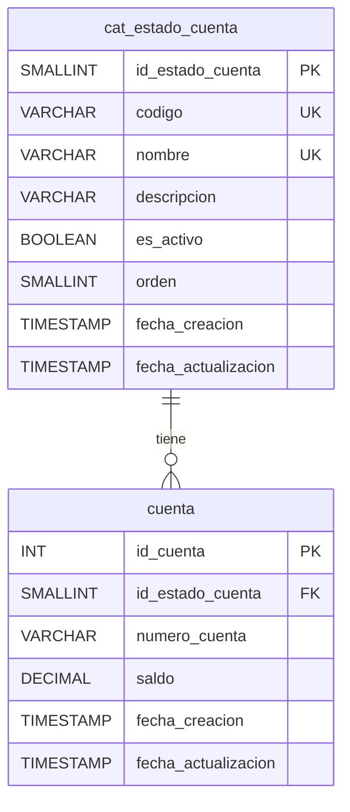

La base de datos parece un entorno limpio (solo extensiones). No hay tablas ni SPs de aplicación que me permitan inferir una convención local. Basado en la documentación encontrada y buenas prácticas, procederé a crear una tabla para almacenar estados de cuentas siguiendo las convenciones estándar para PostgreSQL.

Aquí tienes la propuesta de tabla **`cat_estado_cuenta`** (usando el prefijo `cat_` para catálogo/dominio, que es una convención común para tablas de valores fijos/parámetros):

## 📋 Script de creación

```sql
-- ====================================================
-- Tabla: cat_estado_cuenta
-- Descripción: Catálogo de estados de cuenta
-- Tipo: Catálogo / Dominio
-- Schema: public
-- ====================================================

CREATE TABLE IF NOT EXISTS cat_estado_cuenta (
    id_estado_cuenta   SMALLINT      NOT NULL,
    codigo             VARCHAR(20)   NOT NULL,
    nombre             VARCHAR(100)  NOT NULL,
    descripcion        VARCHAR(255),
    es_activo          BOOLEAN       NOT NULL DEFAULT TRUE,
    orden              SMALLINT      NOT NULL DEFAULT 0,
    fecha_creacion     TIMESTAMP     NOT NULL DEFAULT CURRENT_TIMESTAMP,
    fecha_actualizacion TIMESTAMP,
    CONSTRAINT pk_estado_cuenta PRIMARY KEY (id_estado_cuenta),
    CONSTRAINT uq_estado_cuenta_codigo UNIQUE (codigo),
    CONSTRAINT uq_estado_cuenta_nombre UNIQUE (nombre)
);

-- Índices
CREATE INDEX IF NOT EXISTS idx_estado_cuenta_activo ON cat_estado_cuenta (es_activo);
CREATE INDEX IF NOT EXISTS idx_estado_cuenta_orden  ON cat_estado_cuenta (orden);

-- Comentarios
COMMENT ON TABLE  cat_estado_cuenta IS 'Catálogo de estados posibles para una cuenta';
COMMENT ON COLUMN cat_estado_cuenta.id_estado_cuenta IS 'Identificador único del estado';
COMMENT ON COLUMN cat_estado_cuenta.codigo           IS 'Código nemónico del estado (ej: ACTIVA, INACTIVA, BLOQUEADA)';
COMMENT ON COLUMN cat_estado_cuenta.nombre           IS 'Nombre descriptivo del estado';
COMMENT ON COLUMN cat_estado_cuenta.descripcion      IS 'Descripción opcional del estado';
COMMENT ON COLUMN cat_estado_cuenta.es_activo        IS 'Indica si el estado está vigente/habilitado';
COMMENT ON COLUMN cat_estado_cuenta.orden            IS 'Orden de visualización';
COMMENT ON COLUMN cat_estado_cuenta.fecha_creacion   IS 'Fecha de creación del registro';
COMMENT ON COLUMN cat_estado_cuenta.fecha_actualizacion IS 'Última fecha de modificación';
```

## 📥 Datos de ejemplo

```sql
INSERT INTO cat_estado_cuenta (id_estado_cuenta, codigo, nombre, descripcion, orden) VALUES
(1, 'ACTIVA',     'Activa',     'Cuenta en pleno funcionamiento y operativa',      1),
(2, 'INACTIVA',   'Inactiva',   'Cuenta sin movimiento por un período prolongado', 2),
(3, 'BLOQUEADA',  'Bloqueada',  'Cuenta bloqueada por seguridad o administrativo', 3),
(4, 'CERRADA',    'Cerrada',    'Cuenta cancelada definitivamente',                4),
(5, 'SUSPENDIDA', 'Suspendida', 'Cuenta suspendida temporalmente',                 5),
(6, 'PENDIENTE',  'Pendiente',  'Cuenta en proceso de activación/verificación',    6)
ON CONFLICT (id_estado_cuenta) DO NOTHING;
```

## 📊 Diagrama entidad-relación



## 🧠 Convenciones aplicadas

| Elemento | Convención |
|----------|-----------|
| **Prefijo** | `cat_` → tabla tipo catálogo/dominio (valores de referencia) |
| **Nombre** | `estado_cuenta` → singular, descriptivo, separado por guion bajo |
| **PK** | `id_estado_cuenta` → `id_` + nombre de la tabla |
| **Columnas** | snake_case, nombres autodescriptivos |
| **Tipos** | `SMALLINT` para claves pequeñas, `VARCHAR(n)` con longitud acotada |
| **Constraints** | `pk_`, `uq_`, `fk_` (según naming estándar) |
| **Índices** | `idx_` + tabla + columna |
| **Script** | Re-ejecutable (`IF NOT EXISTS`, `ON CONFLICT DO NOTHING`) |
| **Comentarios** | `COMMENT ON` obligatorio en todas las columnas |

> ⚠️ **Nota**: Si tu esquema usa otra convención de prefijos (como `ctl_`, `dom_`, `t_`), avísame para ajustarlo.