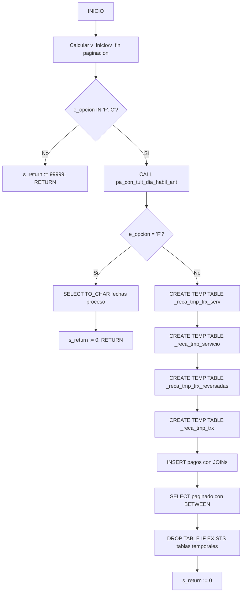

# pa_con_ccertificado_pagos_gen

## Ficha Tecnica

| Atributo | Valor |
|----------|-------|
| **Nombre** | `pa_con_ccertificado_pagos_gen` |
| **Motor** | PostgreSQL 16 |
| **Base de datos** | sp_docs |
| **Esquema** | cobis |
| **Tipo** | Stored Procedure |
| **Complejidad** | Media-Baja |
| **Procesamiento** | OLTP |

## Proposito

Genera certificado de pagos: opcion `F` retorna fechas proceso, opcion `C` consulta pagos del usuario con paginacion usando tablas temporales.

## Parametros

| Nombre | Tipo | Modo | Descripcion |
|--------|------|------|-------------|
| `e_fecha` | `TIMESTAMP` | IN | Fecha de referencia |
| `e_causa` | `VARCHAR(10)` | IN | Causa (codigo empresa) |
| `e_usuario` | `VARCHAR(10)` | IN | Usuario |
| `e_oficina` | `VARCHAR(10)` | IN | Oficina |
| `e_pagina` | `INTEGER` | IN | Pagina (paginacion) |
| `e_limite` | `INTEGER` | IN | Filas por pagina |
| `e_opcion` | `VARCHAR(1)` | IN | `F`=fechas, `C`=pagos |
| `s_return` | `INTEGER` | INOUT | Codigo retorno (0=OK) |

## Variables

| Nombre | Tipo | Uso |
|--------|------|-----|
| `v_fecha_anterior` | `TIMESTAMP` | Ultimo dia habil |
| `v_inicio` | `INTEGER` | Inicio rango paginacion |
| `v_fin` | `INTEGER` | Fin rango paginacion |

## Tablas Referenciadas

| Esquema | Tabla | Tipo |
|---------|-------|------|
| `cobis` | `cl_catalogo` | Catalogo |
| `cobis` | `cl_tabla` | Catalogo |
| `cobis` | `cl_ttransaccion` | Maestro |
| `cobis` | `cl_oficina` | Maestro |
| `cobis` | `cl_ciudad` | Maestro |
| `cob_pagos` | `pg_person_empresa` | Maestro |
| `cob_cuentas` | `cc_tran_servicio` | Transaccion |
| `cob_cuentas` | `cc_tran_servicio_resp` | Transaccion |

## Subprocesos Invocados

| SP | Esquema | Proposito |
|----|---------|-----------|
| `pa_con_tult_dia_habil_ant` | `cobis` | Ultimo dia habil anterior |

## Flujo

## Validacion ARQT-EST-001

| Regla | Estado | Nota |
|-------|--------|------|
| Prefijo `pa_` | Cumple | `pa_con_ccertificado_pagos_gen` |
| Nemonico `con` | Cumple | Contabilidad |
| Parametros `e_`/`s_` | Cumple | `e_` entrada, `s_return` salida |
| Variables `v_` | Cumple | `v_fecha_anterior`, `v_inicio`, `v_fin` |
| Manejo transacciones | No aplica | Solo consultas SELECT/INSERT a temp |
| Control errores | Cumple | `NOT FOUND` despues de cada operacion |
| Cabecera estandar | Cumple | Incluye archivo, motor, BD, servidor, aplicacion, proposito |
| Tablas temporales | Cumple | `_reca_tmp_` drop + create |
| Cleanup temp tables | Cumple | `DROP TABLE IF EXISTS` en cleanup |
| Longitud nombre | Cumple | 32 caracteres |

## Equivalencias Sybase a PostgreSQL

| Sybase | PostgreSQL |
|--------|------------|
| `@@error` | `NOT FOUND` / `GET DIAGNOSTICS` |
| `SET NOCOUNT ON` | Eliminado (no necesario) |
| `PRINT 'ERROR: ...'` | `RAISE NOTICE 'ERROR: ...'` |
| `RETURN @v_return` | `s_return := valor; RETURN;` |
| `EXEC db..sp_name @p1, @p2 OUT` | `CALL schema.sp_name(p1, p2);` |
| `OBJECT_ID('tempdb.dbo.#temp')` | `DROP TABLE IF EXISTS _temp;` |
| `CREATE TABLE #temp (... IDENTITY ...)` | `CREATE TEMP TABLE _temp (... SERIAL ...)` |
| `SELECT ... INTO #temp` | `CREATE TEMP TABLE _temp AS SELECT ...` |
| `CONVERT(INT, @val)` | `val::INTEGER` |
| `CONVERT(VARCHAR, val)` | `val::VARCHAR` / `val::TEXT` |
| `CONVERT(VARCHAR, date, 101)` | `TO_CHAR(date, 'MM/DD/YYYY')` |
| `ISNULL(col, 0)` | `COALESCE(col, 0)` |
| `DATETIME` | `TIMESTAMP` |
| `MONEY` | `NUMERIC(19,4)` |
| `SET @v = expr` | `v := expr;` |
| `cob_pagos.dbo.tabla` | `cob_pagos.tabla` |
| `cob_cuentas..tabla` | `cob_cuentas.tabla` |
| `#temp` (referencia) | `_temp` (mismo nombre) |
