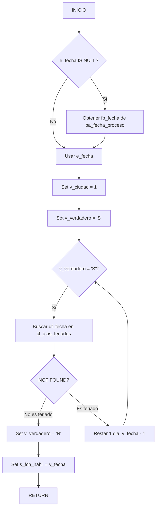

# pa_con_tult_dia_habil_ant

## Ficha Tecnica

| Atributo | Valor |
|----------|-------|
| **Nombre** | `pa_con_tult_dia_habil_ant` |
| **Motor** | PostgreSQL 16 |
| **Base de datos** | sp_docs |
| **Esquema** | cobis |
| **Tipo** | Stored Procedure |
| **Complejidad** | Baja |
| **Procesamiento** | OLTP |

## Proposito

Retorna la fecha del ultimo dia habil anterior a una fecha dada, consultando la tabla de feriados (`cl_dias_feriados`).

## Parametros

| Nombre | Tipo | Modo | Descripcion |
|--------|------|------|-------------|
| `s_fch_habil` | `DATE` | INOUT | Ultimo dia habil anterior |
| `e_fecha` | `DATE` | IN | Fecha de referencia (null = fecha proceso) |

## Variables

| Nombre | Tipo | Uso |
|--------|------|-----|
| `v_verdadero` | `CHAR(1)` | Control del bucle |
| `v_dia_habil` | `DATE` | Fecha habil temporal |
| `v_fecha` | `DATE` | Fecha iterativa |
| `v_ciudad` | `INTEGER` | Ciudad para filtro (default 1) |

## Tablas Referenciadas

| Esquema | Tabla | Tipo |
|---------|-------|------|
| `cobis` | `ba_fecha_proceso` | Parametro |
| `cobis` | `cl_dias_feriados` | Maestro |

## Flujo

## Validacion ARQT-EST-001

| Regla | Estado | Nota |
|-------|--------|------|
| Prefijo `pa_` | Cumple | `pa_con_tult_dia_habil_ant` |
| Parametros `e_`/`s_` | Cumple | `e_fecha`/`s_fch_habil` |
| Variables `v_` | Cumple | `v_verdadero`, `v_fecha`, `v_ciudad`, `v_dia_habil` |
| Manejo transacciones | No aplica | Consulta simple |
| Control errores | No aplica | Sin actualizaciones |
| Cabecera estandar | Cumple | Incluye archivo, motor, BD, servidor, aplicacion, proposito |

## Equivalencias Sybase a PostgreSQL

| Sybase | PostgreSQL |
|--------|------------|
| `@@rowcount` | `FOUND` |
| `dateadd(dd, -1, date)` | `date - 1` |
| `@i_fch_habil datetime output` | `INOUT s_fch_habil DATE` |
| `while ... begin ... end` | `WHILE ... LOOP ... END LOOP` |
| `cobis..tabla` | `cobis.tabla` |
| `convert(varchar, date, 101)` | Innecesario (DATE nativo) |
