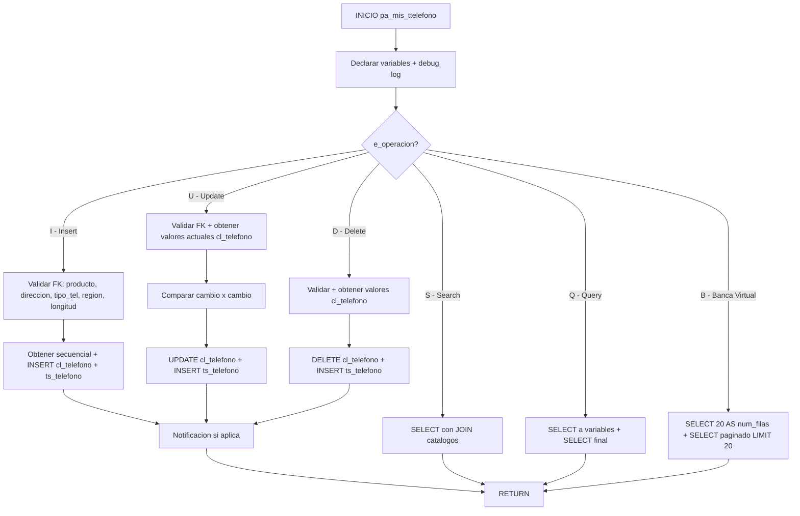

# pa_mis_ttelefono

## Ficha Tecnica

| Atributo | Valor |
|----------|-------|
| **Nombre** | `pa_mis_ttelefono` |
| **Motor** | PostgreSQL 16 |
| **Base de datos** | sp_docs |
| **Esquema** | cobis |
| **Tipo** | Stored Procedure |
| **Complejidad** | Media-Alta |
| **Procesamiento** | OLTP |

## Proposito

CRUD completo de telefonos de clientes. Opera por `e_operacion`:
- `I` (Insert) — Ingreso con TRN 111
- `U` (Update) — Actualizacion con TRN 112
- `S` (Search) — Busqueda con TRN 147
- `Q` (Query) — Consulta especifica con TRN 147
- `D` (Delete) — Eliminacion con TRN 148
- `B` (Banca Virtual) — Consulta paginada para BV con TRN 147

Incluye validaciones: existencia ente, producto, direccion, tipo telefono, region, longitud. Envia notificaciones al cliente por cambios.

## Parametros

| Nombre | Tipo | Modo | Descripcion |
|--------|------|------|-------------|
| `s_ssn` | `INTEGER` | IN | Secuencial transaccion |
| `s_user` | `VARCHAR(128)` | IN | Usuario |
| `s_term` | `VARCHAR(30)` | IN | Terminal |
| `s_date` | `TIMESTAMP` | IN | Fecha |
| `s_srv` | `VARCHAR(30)` | IN | Servicio |
| `s_lsrv` | `VARCHAR(30)` | IN | Servicio logico |
| `s_ofi` | `SMALLINT` | IN | Oficina |
| `s_rol` | `SMALLINT` | IN | Rol |
| `s_org_err` | `CHAR(1)` | IN | Origen error |
| `s_error` | `INTEGER` | IN | Codigo error |
| `s_sev` | `SMALLINT` | IN | Severidad |
| `s_msg` | `VARCHAR(255)` | IN | Mensaje |
| `s_org` | `CHAR(1)` | IN | Origen |
| `p_alterno` | `INTEGER` | IN | Alterno |
| `t_debug` | `CHAR(1)` | IN | Debug S/N |
| `t_file` | `VARCHAR(10)` | IN | Archivo debug |
| `t_from` | `VARCHAR(32)` | IN | Origen debug |
| `t_trn` | `INTEGER` | IN | Codigo transaccion |
| `e_operacion` | `CHAR(1)` | IN | I/U/S/Q/D/B |
| `e_no_cobis` | `CHAR(1)` | IN | Sin COBIS S/N |
| `e_mensaje` | `CHAR(1)` | IN | Mostrar mensaje S/N |
| `e_producto` | `SMALLINT` | IN | Producto |
| `e_ente` | `INTEGER` | IN | Codigo ente |
| `e_direccion` | `SMALLINT` | IN | Direccion |
| `e_secuencial` | `SMALLINT` | IN | Secuencial |
| `e_valor` | `VARCHAR(12)` | IN | Numero telefono |
| `e_tipo_telefono` | `CHAR(1)` | IN | Tipo catalogo |
| `e_tipo_cliente` | `CHAR(1)` | IN | Tipo cliente |
| `e_pertenece` | `CHAR(1)` | IN | Pertenencia |
| `e_extension` | `VARCHAR(20)` | IN | Extension |
| `e_comentario` | `VARCHAR(254)` | IN | Comentario |
| `e_ind_act_presenc` | `CHAR(1)` | IN | Indicador actualizacion presencial |
| `e_tipo_dir` | `VARCHAR(10)` | IN | Tipo direccion |
| `e_canal` | `VARCHAR(10)` | IN | Canal |
| `e_envio_notifica` | `CHAR(1)` | IN | Envio notificacion S/N |
| `s_num_filas` | `SMALLINT` | INOUT | Numero filas BV |
| `s_secuencial` | `SMALLINT` | INOUT | Secuencia asignada |
| `s_msj_error` | `VARCHAR(132)` | INOUT | Mensaje error |

## Variables

| Nombre | Tipo | Uso |
|--------|------|-----|
| `v_sp_name` | `VARCHAR(32)` | Nombre SP |
| `v_today` | `TIMESTAMP` | Fecha actual |
| `v_return` | `INTEGER` | Retorno subprocesos |
| `v_num` | `INTEGER` | Codigo error |
| `v_subtipo` | `CHAR(1)` | Subtipo ente (C=Compania, P=Persona) |
| `v_valor` | `VARCHAR(12)` | Valor telefono (trabajo) |
| `v_prev_valor` | `VARCHAR(12)` | Valor telefono anterior |
| `v_fecha_reg` | `VARCHAR(10)` | Fecha registro actual |
| `v_fecha_crea_cli` | `VARCHAR(10)` | Fecha creacion cliente |
| `v_canal` | `VARCHAR(10)` | Canal notificacion |
| `v_mail` | `VARCHAR(64)` | Email cliente |
| `v_celular` | `VARCHAR(20)` | Celular cliente |

## Tablas Referenciadas

| Esquema | Tabla | Operacion |
|---------|-------|-----------|
| `cobis` | `cl_telefono` | I/U/S/Q/D/B |
| `cobis` | `ts_telefono` | I/U/D (historial) |
| `cobis` | `cl_ente` | I/U/D |
| `cobis` | `cl_producto` | I/U/D |
| `cobis` | `cl_direccion` | I/U/D |
| `cobis` | `cl_catalogo` | I/U/D/S/Q/B |
| `cobis` | `cl_tabla` | I/U/D/S/Q/B |
| `cobis` | `cl_direccion_email` | I/U/D |
| `cobis` | `cl_parametro` | I/U |
| `cobis` | `cl_region_telefono` | I/U/Q |
| `cobis` | `tmp_log_phol2` | I/U/D (log) |

## Flujo por Operacion

## Validacion ARQT-EST-001

| Regla | Estado | Nota |
|-------|--------|------|
| Prefijo `pa_` | Cumple | `pa_mis_ttelefono` |
| Nemonico `mis` | Cumple | Miscelaneos |
| Parametros `e_`/`s_` | Cumple | `e_` entrada, `s_` salida + sistema COBIS |
| Variables `v_` | Cumple | `v_` variables trabajo, `v_prev_` valores anteriores |
| Manejo transacciones | Cumple | PG transaccion implicita |
| Control errores | Cumple | `NOT FOUND` + `RAISE EXCEPTION` despues cada operacion |
| Cabecera estandar | Cumple | Incluye archivo, motor, BD, servidor, aplicacion, proposito |
| Longitud nombre | Cumple | 18 caracteres (< 30) |

## Equivalencias Sybase a PostgreSQL

| Sybase | PostgreSQL |
|--------|------------|
| `create proc dbo.sp_telefono` | `CREATE OR REPLACE PROCEDURE cobis.pa_mis_ttelefono` |
| `@i_operacion`, `@i_ente`, etc. | `e_operacion`, `e_ente`, etc. |
| `@o_secuencial`, `@o_msj_error` | `s_secuencial`, `s_msj_error` (INOUT) |
| `@s_ssn`, `@s_user` (sistema COBIS) | `s_ssn`, `s_user` (IN, conservado) |
| `@w_*` variables trabajo | `v_*` |
| `@v_*` valores anteriores | `v_prev_*` |
| `GOTO mensaje_error` | `IF e_mensaje = 'S' THEN RAISE EXCEPTION; ELSE s_msj_error := ...; RETURN; END IF` |
| `exec cobis..sp_cerror` | `RAISE EXCEPTION` |
| `exec cobis..sp_msj_error` | `s_msj_error := ...; RETURN` |
| `exec cobis..sp_catalogo` | `PERFORM 1 FROM cl_catalogo ... IF NOT FOUND` |
| `exec cobis..sp_gen_sec` | `s_ssn` manejado externamente |
| `exec cobis..sp_notif_cli_mod_dir` | `RAISE NOTICE` (placeholder) |
| `@@rowcount` | `FOUND` |
| `select top 1` | `LIMIT 1` |
| `set rowcount 20` / `set rowcount 0` | `LIMIT 20` (en query) |
| `select @o_num_filas = 20; select @o_num_filas` | `s_num_filas := 20; SELECT s_num_filas AS o_num_filas` |
| `select @var = value` | `SELECT value INTO v_var` o `v_var := value` |
| `convert(varchar(10), date, 101)` | `TO_CHAR(date, 'MM/DD/YYYY')` |
| `datalength(@i_valor)` | `LENGTH(e_valor)` |
| `isnull(x, '')` | `COALESCE(x, '')` |
| `substring(x, 1, 2)` | `SUBSTRING(x, 1, 2)` |
| `getdate()` | `NOW()` o `CURRENT_TIMESTAMP` |
| `begin tran` / `commit tran` | Transaccion implicita PG |
| `cobis..tabla` | `cobis.tabla` |
| `login`, `descripcion`, `catalogo` (UDT) | `VARCHAR(128)`, `VARCHAR(255)`, `VARCHAR(10)` |
| `smallint` | `SMALLINT` |
| `tinyint` | `SMALLINT` |
| `datetime` | `TIMESTAMP` |
