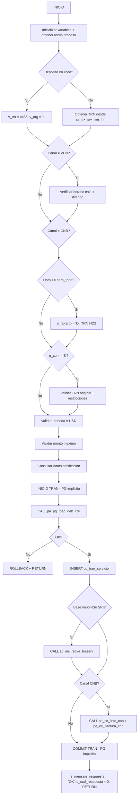

# pa_pg_tpag_reca_varios

## Ficha Tecnica

| Atributo | Valor |
|----------|-------|
| **Nombre** | `pa_pg_tpag_reca_varios` |
| **Motor** | PostgreSQL 16 |
| **Base de datos** | sp_docs |
| **Esquema** | cobis |
| **Aplicacion** | CyberBank (Recaudaciones) |
| **Producto** | Recaudaciones |
| **Tipo** | Stored Procedure |
| **Complejidad** | Alta |
| **Procesamiento** | OLTP |

## Proposito

Procesa pagos/reversos de recaudaciones en via rapida. Orquesta multiples subprocesos:
validacion de horario, registro debito/credito, comisiones, base imponible SRI,
notificaciones, e informacion CNB. Soporta multicanal (VEN, CNB).

## Historial de Cambios

| Ref | Fecha | Autor | Razon |
|-----|-------|-------|-------|
| 1 | 05/May/2022 | J. Guerrero | Emision inicial |
| 2 | 13/Dic/2022 | K. Bastidas | Add campo TC |
| 3 | 05/May/2023 | J. Guerrero | Pagos Mixtos ATX |
| 4 | 04/Jul/2023 | K. Bastidas | Migracion Microservicio SRI |
| 5 | 21/Ago/2023 | K. Bastidas | Ajuste tipo pago Cheque/Efectivo |
| 6 | 13/Nov/2023 | J. Guerrero | Add campo retencion |
| 7 | 06/Nov/2024 | L. Lozano | Flujo municipio Canal CNB |
| 8 | 19/Nov/2024 | C. Salazar | Campo tm_campo_alt_uno |
| 9 | 07/May/2025 | L. Lozano | Exonerar Empresa Arcsa |
| 10 | 08/Sep/2025 | J. Guerrero | MULTICASH MEDLOG |
| 11 | 25/Nov/2025 | J. Guzman | MULTICASH IMMOBILIARIO |
| 12 | 26/Nov/2025 | L. Lascano | SRI TD con TC |
| 13 | 22/Dic/2025 | J. Guerrero | Ajuste fecha proc VEN |
| 14 | 20/Mar/2025 | R. Macias | Ajuste fecha proceso recaudaciones |
| 15 | 28/Abr/2026 | K. Bastidas | Unicomer BackOffice |

## Parametros

Mas de 80 parametros. Categorias principales:

| Categoria | Parametros | Descripcion |
|-----------|------------|-------------|
| Sistema | `e_ssn`, `e_srv`, `e_user`, `e_term`, `e_date`, `e_ofi`, `e_rol` | Sesion COBIS |
| Pago | `e_efectivo`, `e_cheque`, `e_debito`, `e_tarjeta`, `e_total` | Montos |
| Comision | `e_comision_tot`, `e_comision_efe`, `e_comision_chq`, `e_comision_db` | Costos |
| Cliente | `e_ruc_cliente`, `e_nombre_cliente`, `e_servicio`, `e_empresa` | Datos |
| CNB | `e_terminal_id`, `e_comercio`, `e_cod_autorizacion`, `e_agencia`, `e_red` | Canal |
| Salida | `s_fecha_contable`, `s_ssn`, `s_cod_respuesta`, `s_mensaje_respuesta` | Resultados |

## Variables

| Nombre | Tipo | Uso |
|--------|------|-----|
| `v_return` | `INTEGER` | Retorno subprocesos |
| `v_hora_tope` | `INTEGER` | Hora tope (HHMMSS) |
| `v_hora_sys` | `CHAR(8)` | Hora actual (HH:MM:SS) |
| `v_hora` | `INTEGER` | Hora actual (entero) |
| `v_fecha` | `TIMESTAMP` | Fecha proceso local |
| `v_trn` | `INTEGER` | TRN local modificable |
| `v_user` | `VARCHAR(30)` | Usuario local modificable |
| `v_depEspLinea` | `BOOLEAN` | Deposito en linea |
| `v_org` | `CHAR(1)` | Origen (D/L) |
| `v_empresa` | `INTEGER` | Empresa como entero |
| `v_mcash_ref` | `VARCHAR(30)` | Referencia Multicash |
| `v_mcash_benf` | `VARCHAR(30)` | Beneficiario Multicash |

## Tablas Referenciadas

| Esquema | Tabla | Uso |
|---------|-------|-----|
| `cobis` | `ba_fecha_proceso` | Fecha proceso |
| `cobis` | `cl_catalogo` | Catalogos (horario, TRN, etc.) |
| `cobis` | `cl_tabla` | Catalogos |
| `cobis` | `cl_parametro` | Monto maximo |
| `cobis` | `cl_oficina` | Oficina |
| `cob_pagos` | `pg_person_empresa` | Datos empresa |
| `cob_cuentas` | `cc_tran_servicio` | Transacciones servicio |
| `cob_cuentas` | `cc_dias_laborables` | Dias laborables |
| `cob_remesas` | `re_horario` | Horario diferido |

## Subprocesos Invocados

| SP | Esquema | Proposito |
|----|---------|-----------|
| `sp_verifica_caja_rc` | `cob_remesas` | Verificar horario caja |
| `pa_pg_cpag_notificacion` | `cob_pagos` | Datos notificacion |
| `pa_pg_tpag_deb_cre` | `cob_pagos` | Registrar debito/credito |
| `pa_pg_tpag_comision` | `cob_pagos` | Registrar comision |
| `sp_ins_retiva_bieserv` | `cob_pagos` | Base imponible SRI |
| `pa_cc_iinfo_cnb` | `cob_cuentas` | Informacion CNB |
| `pa_cc_ifactura_cnb` | `cob_cuentas` | Factura CNB |

## Flujo Principal

## Validacion ARQT-EST-001

| Regla | Estado | Nota |
|-------|--------|------|
| Prefijo `pa_` | Cumple | `pa_pg_tpag_reca_varios` |
| Nemonico `pg` | Cumple | Pagos |
| Parametros `e_`/`s_` | Cumple | `e_` entrada, `s_` salida |
| Variables `v_` | Cumple | `v_return`, `v_hora_sys`, `v_trn`, etc. |
| Manejo transacciones | Cumple | PG transaccion implicita, errores = rollback automatico |
| Control errores | Cumple | `NOT FOUND` + `ROW_COUNT` + `RAISE` |
| Cabecera estandar | Cumple | Incluye archivo, motor, BD, servidor, aplicacion, proposito |
| Referencia cambios `REF #` | Cumple | Conservados en comentarios |
| Longitud nombre | Cumple | 23 caracteres (< 30) |

## Equivalencias Sybase a PostgreSQL

| Sybase | PostgreSQL |
|--------|------------|
| `create procedure dbo.pa_pg_tpag_reca_varios` | `CREATE OR REPLACE PROCEDURE cobis.pa_pg_tpag_reca_varios` |
| `@s_fecha_contable varchar(10) out` | `INOUT s_fecha_contable VARCHAR(10)` |
| `@e_ssn int` | `IN e_ssn INTEGER` |
| `@e_efectivo money = 0` | `IN e_efectivo NUMERIC(19,4) DEFAULT 0` |
| `@e_ocasional money = 0` | `IN e_ocasional NUMERIC(19,4) DEFAULT 0` |
| `@s_base_imp float = 0 out` | `INOUT s_base_imp DOUBLE PRECISION DEFAULT 0` |
| `@s_envia_notf bit = 0 out` | `INOUT s_envia_notf BOOLEAN DEFAULT FALSE` |
| `@v_depEspLinea bit` | `v_depEspLinea BOOLEAN` |
| `select @var = value` | `v_var := value` |
| `select @var = col from tabla where` | `SELECT col INTO v_var FROM tabla WHERE` |
| `begin tran` / `commit tran` / `rollback tran` | Transaccion implicita PG + `RAISE` para rollback |
| `@@trancount > 0` | No necesario en PG |
| `@@error <> 0` | Errores lanzan excepcion automaticamente |
| `@@rowcount` | `ROW_COUNT` via `GET DIAGNOSTICS` |
| `convert(int, b.valor)` | `b.valor::INTEGER` |
| `convert(varchar(10), date, 101)` | `TO_CHAR(date, 'MM/DD/YYYY')` |
| `convert(varchar, getdate(), 108)` | `TO_CHAR(NOW(), 'HH24:MI:SS')` |
| `getdate()` | `NOW()` |
| `substring(b.valor,1,2) + substring(b.valor,4,2) + substring(b.valor,7,2)` | `SUBSTRING(b.valor,1,2) \|\| SUBSTRING(b.valor,4,2) \|\| SUBSTRING(b.valor,7,2)` |
| `convert(int, ...)` (de concatenacion) | `(...)::INTEGER` |
| `isnull(@e_cod_referencia,'')` | `COALESCE(e_cod_referencia, '')` |
| `len(isnull(x,''))` | `LENGTH(COALESCE(x, ''))` |
| `exec db..sp_name @p1, @p2 OUT` | `CALL schema.sp_name(p1, p2)` |
| `if exists (select 1 from ...)` | `PERFORM 1 FROM ... IF FOUND THEN` |
| `if @e_canal not in ('VEN','CNB')` | `IF e_canal NOT IN ('VEN','CNB') THEN` |
| `index cc_tran_servicio_secuencial` | Eliminado (hint no soportado) |
| `money` | `NUMERIC(19,4)` |
| `float` | `DOUBLE PRECISION` |
| `bit` | `BOOLEAN` |
| `tinyint` | `SMALLINT` |
| `cob_cuentas..tabla` | `cob_cuentas.tabla` |
| `cob_pagos..tabla` | `cob_pagos.tabla` |
