# Diagramas de Flujo - Estándares ARQT-EST-001

## Flujo de Desarrollo bajo Estándar

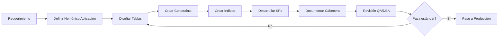

## Nomenclatura de Tablas

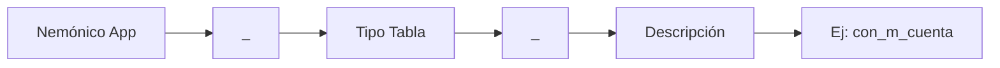

### Tipos Transaccionales

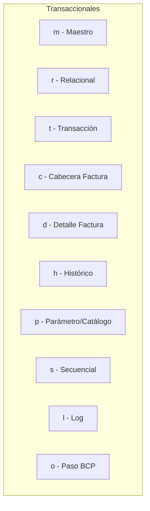

### Tipos Analíticos

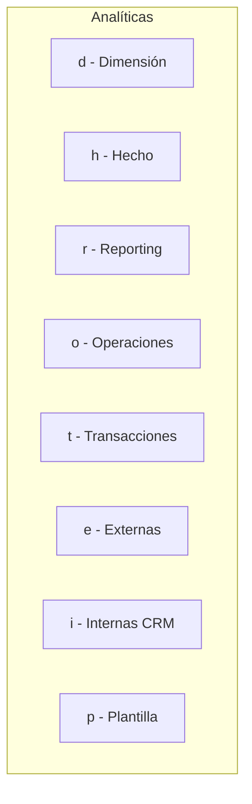

## Nomenclatura de Procedimientos Almacenados

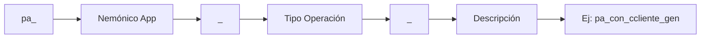

### Tipos de Operación

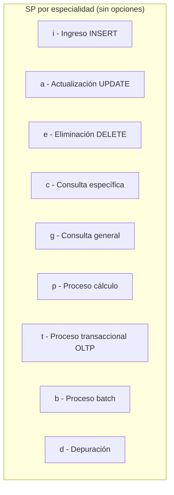

## Convención de Parámetros

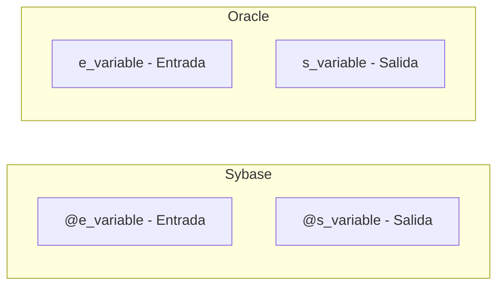

## Convención de Variables

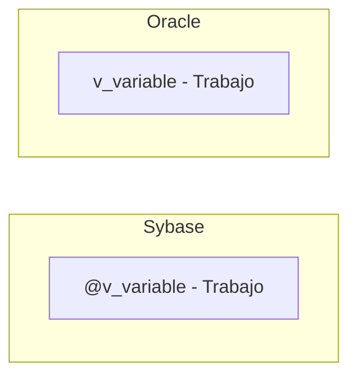

## Constraints Naming

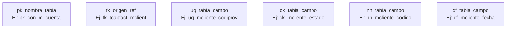

## Estructura Cabecera SP (ANEXO 1)

```mermaid
flowchart TD
    H1["Archivo: nombre_físico"]
    H2["Motor de Base: SYBASE/SQLSERVER/ORACLE"]
    H3["Base de datos: nombre BD"]
    H4["Servidor: nombre servidor"]
    H5["Aplicación: nombre aplicación"]
    H6["Store procedure: nombre SP"]
    H7["Procesamiento: OLTP/BATCH/BATCH ESPECIAL"]
    H8["Ult.ControlTarea: código tarea"]
    H9["Ult.Referencia: REF #"]
    H10["PROPOSITO: descripción"]
```

## Referencia de Cambios

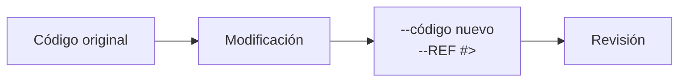

## Ciclo de Vida Tablas Temporales

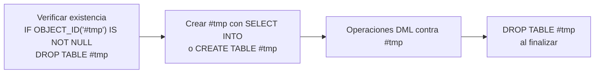

## Flujo de Validación Estática con SonarQube

```mermaid
flowchart TD
    A[SP Compilado] --> B[Cabecera completa?]
    B -->|No| C[Rechazar]
    B -->|Sí| D[Nombre cumple pa_?]
    D -->|No| C
    D -->|Sí| E[Parámetros @e_/@s_?]
    E -->|No| C
    E -->|Sí| F[Variables @v_?]
    F -->|No| C
    F -->|Sí| G[Transacciones OK?]
    G -->|No| C
    G -->|Sí| H[@@error controlado?]
    H -->|No| C
    H -->|Sí| I[REF # marcado?]
    I -->|No| C
    I -->|Sí| J[✅ APROBADO]
```

## Orquestación de Componentes

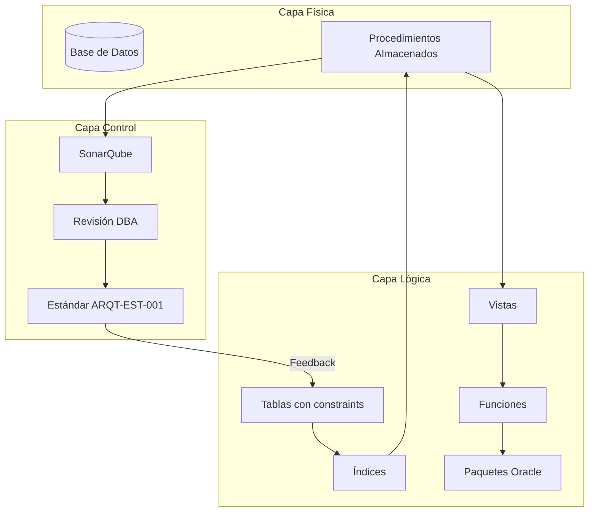
