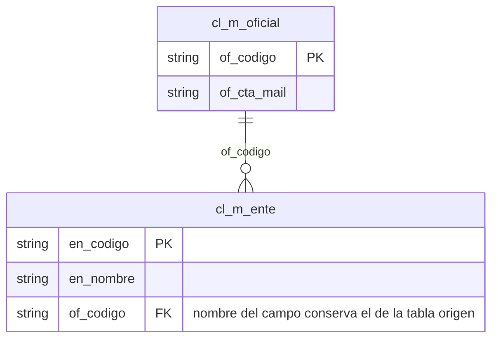

# 5. Estandarización Oracle

> Aplica a las aplicaciones Cyberbank y Tarifario (motor Oracle).

## 5.1 Normas Generales para los objetos de la base de datos Oracle

- El motor Oracle internamente nombra a los objetos en mayúsculas, pero serán declarados en minúsculas.
- Se deben mantener nombres cortos y descriptivos, máximo de 30 caracteres.
- Para facilitar la legibilidad de los diferentes componentes de los nombres de los objetos se utilizará el carácter subrayado ("_").
- En los nombres de los objetos no se utilizarán espacios ni caracteres especiales tales como "$", "#" u otras palabras reservadas que puedan tener sentido propio en contextos de desarrollo tales como bases de datos, lenguajes y sistemas operativos.
- La creación de los objetos no puede incluir comillas en la definición del nombre del objeto.

## 5.2 Normas generales de código PL/SQL

- El nombre del objeto almacenado debe tener una longitud máxima de 30 caracteres.
- No se permiten objetos almacenados inválidos (descompilados) en ambientes productivos.
- Todos los objetos almacenados deben manejar correctamente los errores a través de una sección `EXCEPTION`.
- Se recomienda utilizar `DBMS_UTILITY.format_error_backtrace` para mostrar la pila de errores completa con sus líneas de código donde ocurre el error.
- Los bloques anónimos (`BEGIN END;`) también deben regirse a las normas generales.

## 5.3 Normas de Base de datos

- El nombre de la Base de datos debe tener una longitud máxima de ocho caracteres y en singular. Solo se permite utilizar el carácter de subrayado ("_").
- Si la base va a mantener esquemas históricos debe terminar con "his".
- El juego de caracteres de las bases de datos es AL32UTF8 (`NLS_CHARACTERSET = AL32UTF8`).
- El national character set de las bases de datos es AL16UTF16 (`NLS_NCHAR_CHARACTERSET = AL16UTF16`).
- Se debe considerar que el 30% de la RAM disponible será para el SO, por tanto, el 70% estará disponible para SGA+PGA.
- Siempre es recomendable revisar con Arquitectura la cantidad de CPU Cores a asignar para cumplir con las licencias adquiridas.
- La cantidad de Swap a asignar debe ser igual a la RAM física hasta 16Gb.

Ejemplo:
```
cmbdpro
cmbd_his
```

## 5.4 Normas de roles

- El nombre del rol debe tener una longitud máxima de 30 caracteres y en singular.
- Inicia con el prefijo "ROL" + "_" + Nombre descriptivo del rol.

Ejemplo: `Rol_arquitectura`

## 5.5 Normas de tablespaces

1. El nombre del tablespace debe tener una longitud máxima de 30 caracteres y en singular.
2. Inicia con el prefijo "TS" + "_" + Nombre descriptivo del tablespace + "_" + Tipo de Tablespace.
3. Se deben crear siempre los tablespace de datos y de índices, el tablespace de Lob se creará cuando se requiera almacenar columnas de tipo LOB.
4. Todos los tablespaces deben gestionar sus extents localmente (`EXTENT MANAGEMENT LOCAL`) y manejar sus segmentos de manera automática (`SEGMENT SPACE MANAGEMENT AUTO`). Estas configuraciones son predeterminadas cuando no se especifican.

| Tipo | Tablespace |
|---|---|
| DAT | Datos |
| IND | Índices |
| LOB | Segmentos LOB |

Ejemplo: `TS_REPORT_CENTER_DAT`

## 5.6 Normas de Esquema

- El nombre del esquema debe tener una longitud máxima de 30 caracteres y en singular.
- Si el esquema almacena información histórica debe finalizar con `_his`.
- Inicia con el prefijo `DB` + "_" + Nombre descriptivo del esquema.

Ejemplos:

| Esquema | Significado |
|---|---|
| `DB_ENUMERADOS_CORE` | CyberBank |
| `DB_REPORT_CENTER` | Base de datos ReportCenter |

## 5.7 Normas de tablas

- El nombre de la tabla debe tener una longitud máxima de 25 caracteres, debe ser descriptivo y en singular.
- Debe empezar con el nemónico de la aplicación (ver Anexo 4 en `anexos.md`) + "_" + tipo de tabla + "_" + descripción de la tabla.
- Los valores permitidos para identificar el tipo de tabla son:

**Tipos de tablas para Base de datos Transaccionales**

| Tipo/tabla | Usado en |
|---|---|
| M | Maestro |
| R | Relacional (usada para evitar tablas con relación muchos a muchos) |
| T | Transacción |
| C | Cabecera de Transacción (Factura) |
| D | Detalle de Transacción (Detalle de factura) |
| H | Históricos |
| P | Parámetro/catálogo |
| S | Secuenciales |
| L | Log de transacciones |

Ejemplos:

| Objeto | Significado |
|---|---|
| `DB_CONTABILIDAD.CON_M_CUENTA` | Maestro de cuentas contables |
| `DB_CUENTA_AHORRO.AHO_T_SERVICIO` | Transacciones de servicio de ahorros |
| `DB_CUENTA_AHORRO.AHO_H_BLOQUEO` | Histórico de transacciones de bloqueo |
| `DB_SRI_IVA.IVA_C_FACTURA_SRI` | Cabecera de factura |
| `DB_SRI_IVA.IVA_D_FACTURA_SRI` | Detalle de factura |
| `DB_TRANSAC_INTERNET.INT_L_EVENTOS` | Log de eventos de internet |

- Las tablas de transacción, cabecera y detalle son consideradas OLTP, la información no necesaria en línea debe, a través de procesos BATCH, pasar a tablas históricas.
- Toda tabla histórica debe ser depurada de acuerdo al tiempo de permanencia de los datos establecidos por el usuario final y las leyes vigentes.
- Cuando se hace referencia a la tabla, en cualquier código, deberá hacerlo iniciando con el nombre del esquema `<esquema>.<tabla>`.
- La sentencia de creación de tablas debe siempre especificar los tablespaces de datos y de sus índices cuando se especifiquen constraints de tipo PK (`USING INDEX TABLESPACE`).
- Si la tabla va a contener columnas LOB, siempre se recomienda el uso de segmentos Lob SecureFile en vez de BasicFile.
- Se recomienda tener todas las tablas e índices sin grado de paralelismo (`NOPARALLEL`) ya que interfiere en la generación de planes de ejecución.
- Por restricciones de licenciamiento **no está permitida** la creación de tablas o índices particionados ni compresión de éstos.
- Las opciones de encriptación o de seguridad avanzada se deben revisar de igual forma porque no contamos con Oracle Advanced Security.

## 5.8 Normas de tablas temporales

- El nombre de la tabla temporal debe tener una longitud máxima de 25 caracteres, descriptivo y en singular.
- La tabla debe empezar con el nemónico de la aplicación + "_tmp_" + descripción de la tabla.
- Si la data de la tabla temporal sobrepasa los 10 GB, se recomienda crear un tablespace temporal específico para el uso de estas tablas temporales. En estos casos se recomienda el uso de índices para un mejor rendimiento.
- Para crear una tabla temporal en Oracle se utiliza el formato tradicional, donde el objeto existe permanentemente (se crea una vez) y se reutiliza varias veces usando segmentos temporales. Por definición se guarda en el diccionario de datos (sentencia `CREATE GLOBAL TEMPORARY TABLE`), los datos existen mientras se realiza la transacción o mientras dure la sesión.

Ejemplo de tabla temporal global de Contabilidad (Nemónico: CON) → `con_tmp_producto`

## 5.9 Normas de campos de las tablas

- Longitud máxima del nombre del campo 25 caracteres.
- Por restricción lógica de fábrica se permite un máximo de 1000 columnas en una tabla.
- No se permitirá la utilización de campos de tipo `LONG`, `LONG RAW` ni `RAW`. Se recomienda que se utilicen campos de tipo LOB.
- Al usar columnas LOB se debe especificar de tipo SecureFile y el tablespace de almacenamiento (`STORE AS SECUREFILE TABLESPACE TS_CUENTA_LOB`).
- Debe empezar con las iniciales o prefijo (2 letras) de la tabla + "_" + descripción del campo.
- Al establecer constraints PK o UK al mismo nivel de las columnas se deben tomar en consideración los nombres de constraints y de sus índices, así como el tablespace destino (`USING INDEX TABLESPACE`).

Ejemplos:

| Tabla | Campos |
|---|---|
| `cc_m_chequera` | `ch_cuenta`, `ch_chequera`, `ch_fecha_emision`, ... |
| `cc_h_tran_monet` | `tm_fecha`, `tm_secuencial`, `tm_cuenta` |

- Al establecer una relación que permita mantener la integridad referencial entre tablas de aplicación, el campo debe mantener el nombre de la tabla que origina la relación.



## 5.10 Normas de constraints para clave Primaria

- Iniciará con la constante "pk_" + nombre de la tabla.
- El campo seleccionado de preferencia debe ser numérico y obligatoriamente no nulo.
- Al establecer constraints PK deben tomar en consideración los nombres de constraints y de sus índices, así como el tablespace destino de su índice (`USING INDEX TABLESPACE`).
- Todos los constraints deben estar habilitados y validados.

Ejemplo: `pk_con_m_cuenta`

## 5.11 Normas de constraints para clave Foránea

- Iniciará con la constante "fk_" + abreviatura de la tabla origen + "_" + abreviatura de la tabla referenciada.
- Se recomienda que todas las columnas foreign key tengan su respectivo índice para evitar bloqueos excesivos al momento de borrar registros padres.
- Todos los constraints deben estar habilitados y validados.

Ejemplo: `fk_tcabfact_mclient`

## 5.12 Normas de constraint Unique

- Iniciará con la constante "uq_" + abreviatura de la tabla + "_" + abreviatura del campo.
- Al establecer constraints UK deben tomar en consideración los nombres de constraints y de sus índices, así como el tablespace destino de su índice (`USING INDEX TABLESPACE`).
- Todos los constraints deben estar habilitados y validados.

Ejemplo: `uq_mcliente_codiprov`

## 5.13 Normas de constraints Check

- Iniciará con la constante "ck_" + abreviatura de la tabla + "_" + abreviatura del campo.
- Todos los constraints deben estar habilitados y validados.

Ejemplo: `ck_mcuentas_rango1`

## 5.14 Normas de Secuencias

- Iniciará con la constante "sq_" + abreviatura de la tabla + "_" + abreviatura del campo.

Ejemplo: `sq_mcliente_codigo`

- Si no se especifica cache, la base de datos le asigna una predeterminada de 20. Si la tabla va a recibir millones de registros asigne una caché de 100 (`CACHE 100`) y si va a recibir cientos de millones de registros asigne una caché de 1000 (`CACHE 1000`).
- No usar la cláusula `ORDER` porque afecta la transaccionalidad en bases de datos RAC.

## 5.15 Normas de los índices

- Los índices deben empezar con la constante "i_" + nombre de la tabla + "_" + secuencia correspondiente al índice.

Ejemplos:
```
i_con_m_cuentas_01
i_aho_m_cliente_01
```

- Para tablas OLTP se recomienda como máximo tener cuatro índices incluida la clave primaria. Al excederse de este número se impacta directamente el rendimiento de las instrucciones INSERT, UPDATE, DELETE y MERGE.
- Se debe evitar crear índices a tablas de pocos registros.
- Para índices compuestos, el orden de los campos es importante, es recomendable escoger los campos más selectivos (menos repetitivo) al menos selectivo (más repetitivo).
- Se recomienda que los índices compuestos contengan pocos campos. Oracle permite hasta un máximo de 16 campos por índice.
- Es recomendable seleccionar campos cuyo tipo de dato es numérico o fechas y que sean obligatorios "not null".
- Se permite para tablas DSS contener más de cuatro índices.
- Todos los índices, inclusive aquellos creados por constraints, deben especificar su correspondiente tablespace de índices.
- Se recomienda tener todas las tablas e índices sin grado de paralelismo (`NOPARALLEL`) ya que interfiere en la generación de planes de ejecución.
- Por restricciones de licenciamiento **no está permitida** la creación de tablas o índices particionados.

## 5.16 Normas de Disparadores (triggers)

- Iniciará con la constante "tr_" + abreviatura de la tabla + "_" + abreviatura del nombre representativo del disparador.

Ejemplo: `tr_mcliente_inserta_alta`

## 5.17 Normas de paquetes

- Los paquetes en Oracle contienen objetos relacionados tales como procedimientos, funciones, subprogramas, cursores, excepciones, variables, etc.
- El nombre del paquete debe empezar con la constante "pc_" + nemónico de la aplicación (ver Anexo 4 en `anexos.md`) + "_" + nombre descriptivo del paquete.

Ejemplo: `pa_con_generacomprobante` → Validación y Generación de un comprobante contable

## 5.18 Normas de procedimientos almacenados

- El nombre del procedimiento almacenado debe empezar con la constante "pa_" + nemónico de la aplicación + "_" + descripción del procedimiento.

Ejemplo: `pa_con_consultacheques` → Consulta general de cheques

## 5.19 Normas de funciones

- El nombre de la función debe tener una longitud máxima de 30 caracteres.
- El nombre de la función debe empezar con la constante "fu_" + nemónico de la aplicación + "_" + descripción de la función.
- No se permite la invocación de funciones en una sentencia SQL (Insert/Update/delete/select).

Ejemplo: `fu_con_ultimoDiaMes`

## 5.20 Normas de parámetros

- El nombre del parámetro debe tener una longitud máxima de 25 caracteres.
- El nombre del parámetro inicia con el tipo de parámetro + descripción del parámetro.
- Los tipos de parámetros son:
  - `e_` = Parámetro de entrada
  - `s_` = Parámetro de salida

Ejemplos:
```
e_cuenta
s_mensaje
```

## 5.21 Normas de variables dentro de paquetes/procedimientos/funciones

- El nombre de la variable debe tener una longitud máxima de 25 caracteres.
- La variable se inicia con la letra "v" + "_" + descripción de variable.
- `v_` = variable de trabajo

Ejemplo: `v_oficina`

## 5.22 Normas de vistas

- La longitud máxima del nombre de la vista es de 30 caracteres.
- El nombre de la vista empezará con "vs_" + nemónico de la aplicación + "_" + descripción de la vista.
- Siempre es recomendable revisar el plan de ejecución de la vista, sobre todo en vistas complejas, evitando los full scans en tablas con muchos registros.

Ejemplos:

| Vista | Significado |
|---|---|
| `vs_con_abono` | Consulta de transacciones de abono |
| `vs_con_caja` | Consulta de transacciones de caja |

## 5.23 Normas de escritura de sentencias SQL

- Siempre es recomendable revisar el plan de ejecución de toda sentencia SQL evitando los `TABLE ACCESS FULL` en tablas grandes o en tablas que vayan a crecer más de 1Gb.
- Al leer el plan de ejecución evite los pasos "MERGE JOIN CARTESIAN" (producto cartesiano) a menos que se trate de muy pocos registros.
- Al leer el plan de ejecución considere como ineficiente los pasos "INDEX FAST FULL SCAN" porque no son recomendables en ambientes OLTP. Los índices son óptimos cuando se acceden como `UNIQUE SCAN` o al menos `RANGE SCAN`.
- Siempre es recomendable un SQL que procese 1 millón de registros en vez de 1 millón de SQLs que procesen 1 registro.
- Siempre use variables en vez de constantes ya que facilitan la reutilización.

```sql
-- Preferido
WHERE A.CO_ESTADO = :v_std
-- En vez de
WHERE A.CO_ESTADO = 'AHO'
```

- Siempre las comparaciones de variables en cláusulas `WHERE` deben ser del mismo tipo de dato, evite comparar `VARCHAR2 = NUMBER`, `TIMESTAMP = DATE`, etc. Las comparaciones pueden evitar el uso de índices y forzar full Access.
- No use funciones en columnas que están indexadas porque evita la utilización del índice.

```sql
-- Preferido
WHERE P.PE_CEDULA LIKE '09%'
-- En vez de
WHERE SUBSTR(P.PE_CEDULA,1,2)='09'
```

- Eviten los querys que extraen todas las columnas (`SELECT * FROM`), traiga siempre solo lo necesario.
- Analice si los `UNION` pueden ser reemplazados por `UNION ALL`.
- No use los `DISTINCT`.
- Evite los ordenamientos (`ORDER BY`) en subquerys a menos que sean necesarios.
- Evite el uso de sentencias `SELECT FOR UPDATE` ya que producen bloqueos innecesarios.
- Asegúrese de actualizar solo las columnas que hayan cambiado (Update Changed Columns Only = Yes). La sobrescritura de claves PK o FK ocasiona bloqueos innecesarios.

```sql
-- Preferido: UPDATE SET (una o dos columnas)
-- En vez de: UPDATE SET (todas las columnas)
```

- En sentencias `DELETE`, haga una revisión de si la operación causará una validación de registros huérfanos en tablas hijas. Si dichas tablas hijas son grandes se debe asegurar que dichas tablas tengan índices en sus columnas FK.
- Evite realizar `INSERT` de claves duplicadas porque ocasionan bloqueos hasta que se reciba el commit.
- Si una tabla ha recibido cambios o cargas masivas y va a entrar en operación inmediatamente, se debe capturar estadísticas de forma manual antes de entrar en operación, ya que todas las operaciones de captura de estadísticas se realizan fuera de hora laboral.
- Evite el uso de Subqueries a nivel de columnas, se debe preferir poner la tabla del subquery a nivel del `FROM` principal para evitar I/O excesivo.

```sql
-- Evitar
SELECT A.PA_CODIGO,
       (SELECT ESTADO FROM DB_CONTAB.CO_T_EVENTOS WHERE ...)
FROM ...
```

- Evite el uso de hints ya que alteran el normal procesamiento del optimizador basado en costos.

## 5.24 Normas de archivos .SQL para Pases y Ordenes de Proceso

- No se debe mezclar sentencias DDL y DML en un mismo archivo SQL.
- Los scripts de base de datos se ejecutan en SQL*Plus por lo que es obligatorio que envíen la barra (`/`) al final de cada bloque PL/SQL tanto para compilación de procedimientos almacenados como para ejecución de bloques anónimos.
- No se permite incluir espacios en los nombres de archivos `.SQL`.
