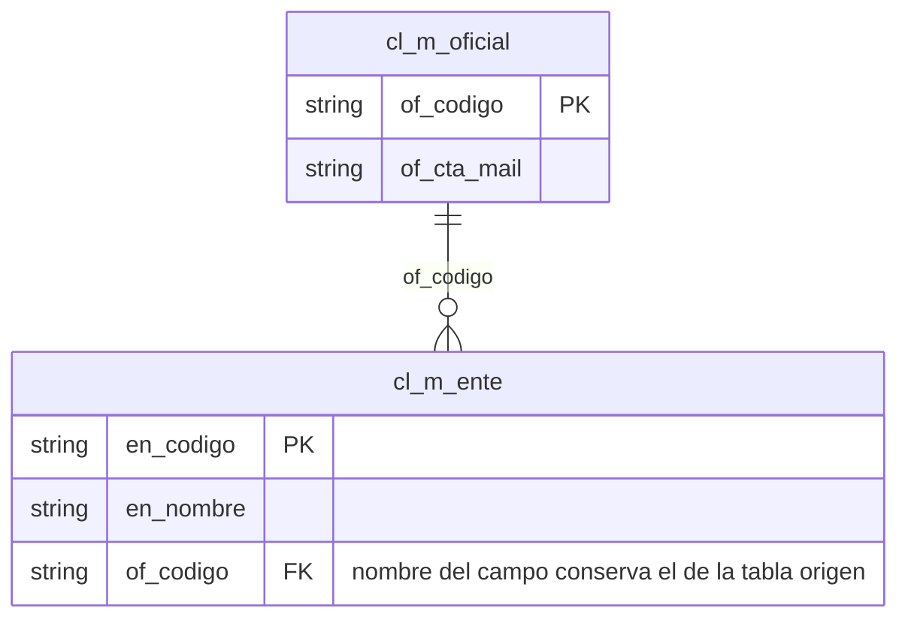

# 4. Estandarización Sybase y SQL Server

> Norma compartida íntegramente por Sybase (Cobis - Core bancario) y SQL Server (VDT, MonitorPlus, entre otros).

## 4.1 Normas Generales para los objetos de la base de datos

- Los nombres de los objetos deben estar en minúsculas y en singular.
- Se deben mantener nombres cortos y descriptivos.
- Para facilitar la legibilidad de los diferentes componentes de los nombres de los objetos se utilizará el carácter de subrayado ("_").
- En los nombres de los objetos no se utilizarán espacios ni caracteres especiales tales como "$", "#" u otros que puedan tener sentido propio en contextos de desarrollo tales como bases de datos, lenguajes y sistemas operativos.

## 4.2 Normas de Bases de datos

- El nombre de la Base de datos debe tener una longitud máxima de 25 caracteres y en singular.
- Si la información almacenada en la base de datos es alimentada por aplicaciones COBIS debe empezar con el prefijo `cob_`.
- Si pertenece a aplicaciones no Cobis debe anteponérsele el prefijo `db_`.
- Si la base de datos almacena información histórica debe finalizar con `_his`.

Ejemplos:
```
cob_cuentas
cob_cuentas_his
db_sat_his
```

**Nota**: Cuando sean aplicaciones adquiridas a proveedores externos (como Facturación Electrónica, Evolution, etc) y sean un paquete cerrado, es necesario incluir en la negociación un anexo de la parte técnica donde entreguen la documentación relacionada a: estándar de la base de datos, diccionario de datos, modelo entidad relación, procesos de depuración, permisos especiales – seguridad, según aplique.

De no cumplirse con la documentación técnica se considerará lo siguiente:

- El área de desarrollo debe solicitar autorización del gerente de Desarrollo para que sea considerado como excepción.
- No se revisará el diseño de la base de datos ni el código de la aplicación a implementar.
- El área de base de datos no se responsabiliza por la degradación de la aplicación, por lo cual el área de desarrollo será responsable de gestionar, coordinar ó realizar las revisiones y optimización con el proveedor o internamente.

## 4.3 Nemónico de Aplicación

El nemónico de la aplicación será el mismo que está establecido en la herramienta Rational ClearQuest. Por ejemplo:

| Nemónico | Nombre de aplicación |
|---|---|
| con | Contabilidad |
| int | Internet |
| aho | Cuenta de Ahorros |
| iva | Anexos Iva |
| dwh | Datawarehouse |

> El catálogo completo de nemónicos de todas las aplicaciones del banco está en `anexos.md` (Anexo 4).

## 4.4 Normas de tablas

- El nombre de la tabla debe tener una longitud máxima de 25 caracteres, debe ser significativo y en singular.
- Debe empezar con el nemónico de la aplicación + "_" + tipo de tabla + "_" + descripción de la tabla.
- Los valores permitidos para identificar el tipo de tabla son:

**Tipos de tablas para Base de datos Transaccionales**

| Tipo/tabla | Usado en |
|---|---|
| m | Maestro |
| r | Relacional (usada para evitar tablas con relación muchos a muchos) |
| t | Transacción |
| c | Cabecera de Transacción (Factura) |
| d | Detalle de Transacción (Detalle de factura) |
| h | Históricos |
| p | Parámetro/catálogo |
| s | Secuenciales |
| l | Log de transacciones |
| o | Tablas de paso de información para procesos – BCP, Normalmente no tienen índice |

**Tipos de tablas para Base de datos Analíticas**

| Tipo/tabla | Usado en |
|---|---|
| d | Dimensiones |
| h | Hecho |
| r | Datos de entrada para Excel y/ó reporting services |
| o | Operaciones bancarias |
| t | Transacciones de operaciones |
| e | Datos de entidades externas |
| i | Datos internos por ejemplo: CRM |
| p | Plantilla |

Ejemplos:

| Nombre | Significado |
|---|---|
| `con_m_cuenta` | Maestro de cuentas contables |
| `aho_t_servicio` | Transacciones de servicio de ahorros |
| `aho_h_bloqueo` | Histórico de transacciones de bloqueo |
| `iva_c_factura_sri` | Cabecera de factura |
| `iva_d_factura_sri` | Detalle de factura |
| `int_l_eventos` | Log de eventos de internet |
| `dwh_d_oficiales` | Dimensión de Oficiales |

- Las tablas de transacción, cabecera y detalle son consideradas OLTP, la información no necesaria en línea debe a través de procesos BATCH pasar a tablas históricas.
- Toda tabla histórica debe ser depurada de acuerdo con tiempo de permanencia de los datos establecidos por el usuario final y las leyes vigentes.
- Cuando el dueño del objeto es por omisión `dbo` se nombrará a la tabla como `<base_de_datos>..<tabla>`. En caso contrario, se nombrará `<base_de_datos>.<dueño>.<tabla>`.

## 4.5 Normas de Tablas Temporales

- Este tipo de tablas utilizan la base de datos `tempdb`.
- El nombre de la tabla temporal debe tener una longitud máxima de 25 caracteres, descriptivo y en singular.
- La tabla debe empezar con el carácter "#" + nemónico de la aplicación + "_tmp_" + descripción de la tabla.
- El límite actual para la base de datos tempdb en sybase es de 5 GB de data y 3 GB de log.
- No se permite crear tablas temporales dentro de una transacción.

Ejemplo:

```
Temporal (tempdb) → #con_tmp_producto
```

## 4.6 Normas para Tablas Fijas de uso temporal – Solo aplica a procesos BATCH en SYBASE

- El nombre de la tabla temporal debe tener una longitud máxima de 25 caracteres, descriptivo y en singular.
- La nomenclatura de las tablas fijas temporales es: Nemónico de la aplicación + "_tmp_" + descripción de la tabla.

**Consideraciones y restricciones al usar la base de datos `db_general` y `db_temporal`**

- En la base de datos `db_general` se debe evitar dejar pobladas las tablas a excepción que sea una tabla de pocos registros y que es truncada cada vez que inicia/finaliza un nuevo proceso.
- En la base de datos `db_temporal`/`db_general` no se compilan procedimientos almacenados.
- En la base de datos `db_temporal` no debe permanecer ningún tipo de objeto.

**Tablas temporales fijas**

| Base de datos | Uso |
|---|---|
| `db_temporal..con_tmp_cuenta` | Antes de terminar el proceso, las tablas se truncan y eliminan. |
| `db_general..cta_tmp_cuenta` | Las tablas se mantienen para que sean usadas por otros procesos, al finalizar se truncan y eliminan. |

## 4.7 Normas de los campos de tablas

- Longitud máxima del nombre del campo 25 caracteres.
- Debe empezar con las iniciales o prefijo (2 letras) de la tabla + "_" + descripción del campo.

Ejemplos — campos de la tabla `cc_m_chequera`:

| Tabla | Campos |
|---|---|
| `cc_m_chequera` | `ch_cuenta`, `ch_chequera`, `ch_fecha_emision`, ... |
| `cc_h_tran_monet` | `tm_fecha`, `tm_secuencial`, `tm_cuenta` |

- Al establecer una relación que permita mantener la integridad referencial entre tablas de aplicación NO COBIS, el campo debe mantener el nombre de la tabla que origina la relación.

Ejemplo (diagrama entidad-relación: `cl_m_oficial.of_codigo` es referenciado desde `cl_m_ente.of_codigo`):



## 4.8 Normas de constraints para clave Primaria

- La longitud máxima del nombre de constraint permitido es de 30 caracteres.
- Iniciará con la constante "pk_" + nombre de la tabla.
- No se permite índice compuesto como clave primaria.
- El campo seleccionado de preferencia debe ser numérico.

Ejemplo: `pk_con_m_cuenta`

## 4.9 Normas de constraints para clave Foránea

- La longitud máxima del nombre de constraint permitido es de 30 caracteres.
- Iniciará con la constante "fk_" + abreviatura de la tabla origen + "_" + abreviatura de la tabla referenciada.

Ejemplo: `fk_tcabfact_mclient`

## 4.10 Normas de constraint Null

- La longitud máxima del nombre de constraint permitido es de 30 caracteres.
- Iniciará con la constante "nu_" + abreviatura de la tabla + "_" + abreviatura del campo.

Ejemplo: `nu_mcliente_codiprov`

## 4.11 Normas de constraint Not Null

- La longitud máxima del nombre de constraint permitido es de 30 caracteres.
- Iniciará con la constante "nn_" + abreviatura de la tabla + "_" + abreviatura del campo.

Ejemplo: `nn_mcliente_codigo`

## 4.12 Normas de constraint Unique

- La longitud máxima del nombre de constraint permitido es de 30 caracteres.
- Iniciará con la constante "uq_" + abreviatura de la tabla + "_" + abreviatura del campo.

Ejemplo: `uq_mcliente_codiprov`

## 4.13 Normas de constraints Default

- La longitud máxima del nombre de constraint permitido es de 30 caracteres.
- Iniciará con la constante "df_" + abreviatura de la tabla + "_" + abreviatura del campo.

Ejemplo: `df_mcliente_fecha`

## 4.14 Normas de constraints Check

- La longitud máxima del nombre de constraint permitido es de 30 caracteres.
- Iniciará con la constante "ck_" + abreviatura de la tabla + "_" + abreviatura del campo.

Ejemplo: `ck_mcliente_estado`

## 4.15 Normas de los índices

- La longitud máxima del nombre de los índices es de 30 caracteres.
- Los índices deben empezar con la constante "i_" + nombre de la tabla + "_" + secuencia.

Ejemplos:
```
i_con_m_cuentas_01
i_aho_m_cliente_01
```

- Para tablas OLTP se recomienda como máximo tener cuatro índices incluida la clave primaria. Al excederse de este número se impacta directamente el rendimiento de las instrucciones INSERT, UPDATE, DELETE y MERGE.
- Se debe evitar crear índices a tablas de pocos registros. Si los datos ocupan más de una página de datos puede crearse un índice.
- Para índices compuestos, el orden de los campos es importante, es recomendable escoger los campos más selectivos (menos repetitivo) al menos selectivo (más repetitivo).
- Los índices compuestos deben estar compuestos por pocos campos.
- Es recomendable seleccionar campos cuyo tipo de dato es numérico y que sean obligatorios "not null".
- Se permite para tablas DSS contener más de cuatro índices.

## 4.16 Normas de procedimientos almacenados

- El nombre del procedimiento almacenado debe tener una longitud máxima de 30 caracteres.
- El nombre del procedimiento almacenado debe empezar con la constante "pa_" + nemónico de la aplicación + "_" + tipo de procedimiento + descripción del procedimiento.
- Los procedimientos almacenados serán desarrollados de acuerdo con la especialidad de la operación, **no se permite el uso de opciones**. Los tipos de operación permitidos son los siguientes:

| Tipo | Operación |
|---|---|
| i | Ingreso |
| a | Actualización |
| e | Eliminación |
| c | Consulta especifica |
| g | Consulta general (Retorno de cientos de registros - rangos) |
| p | Proceso de cálculo (calcula impuesto) |
| t | Proceso transaccional (OLTP) |
| b | Proceso batch - masivo (Batch - select into) |
| d | Depuración de información |

Ejemplos:

| Procedimiento | Operación |
|---|---|
| `pa_con_iprovincia` | Ingreso de provincia |
| `pa_con_aprovincia` | Actualización de provincia |
| `pa_con_eprovincia` | Eliminación de provincia |
| `pa_con_bfindemes` | Batch de fin de mes |
| `pa_con_dmovcontable` | Depuración de movimientos contables |
| `pa_con_pintmora` | Proceso de cálculo de interés por mora |
| `pa_con_ccliente_gen` | Consulta de cliente |
| `pa_con_ccliente_ced` | Consulta por cliente por cédula |
| `pa_con_ccliente_ruc` | Consulta por cliente por ruc |
| `pa_con_ccliente_pas` | Consulta por cliente por pasaporte |
| `pa_con_gcheque` | Consulta general de cheques |

## 4.17 Normas de parámetros

Si el procedimiento es invocado por la aplicación COBIS, el nombre del parámetro debe cumplir con el estándar descrito en el *Manual de Referencia Técnica de cobis*, caso contrario se aplica lo siguiente:

- El nombre del parámetro debe tener una longitud máxima de 25 caracteres.
- El nombre del parámetro inicia con el tipo de parámetro + descripción del parámetro.
- Los tipos de parámetros son:
  - `@e_` = Parámetro de entrada
  - `@s_` = Parámetro de salida

Ejemplos:
```
@e_cuenta
@s_mensaje
```

## 4.18 Normas de funciones de usuario

- El nombre de la función debe tener una longitud máxima de 30 caracteres.
- El nombre de la función debe empezar con la constante "fu_" + nemónico de la aplicación + "_" + descripción de la función.
- No se permite la invocación de funciones en una sentencia DML (Insert/Update/delete/select).

Ejemplo: `fu_con_ultimoDiaMes`

## 4.19 Normas de variables dentro de procedimientos/funciones

- El nombre de la variable debe tener una longitud máxima de 25 caracteres.
- La variable se inicia con el carácter `@` seguido de la letra "v" + "_" + descripción de variable.
- `@v_` = variable de trabajo

Ejemplo: `@v_oficina`

## 4.20 Normas de vistas

- La longitud máxima del nombre de la vista es de 30 caracteres.
- El nombre de la vista empezará con "vs_" + nemónico de la aplicación + "_" + descripción de la vista.

Ejemplos:

| Vista | Significado |
|---|---|
| `vs_con_abono` | Consulta de transacciones de abono |
| `vs_con_caja` | Consulta de transacciones de caja |

- Aquellas consultas que requieren forzamiento de índice deben estar declaradas en una vista y no en el procedimiento almacenado. Esto mejorará la administración.
- Para el ambiente de sybase, se permite el uso de planes abstractos.

## 4.21 Programas SQR

- Es permitido el acceso directo a las tablas para aquellos programas SQR cuya funcionalidad interna es la de realizar reportes con quiebres de control, los demás procesos deben invocar a procedimientos almacenados.
- Todo procedimiento almacenado debe ser invocado con el parámetro `–XC` para evitar abrir una nueva conexión a la base de datos.

Ejemplo:
```
execute -XC cob_gov..sp_cab_documento_sri
```

- Para evitar creación de procedimientos almacenados dinámicamente, ejecutar los programas SQR con la opción `–XP`.

## 4.22 Nombre físico de programas

### 4.22.1 Nombre físico de procedimientos almacenados

**Para aplicaciones COBIS**

- Longitud máxima del nombre del programa de 8 caracteres.
- El nombre debe empezar con el nemónico de la aplicación.
- El archivo debe tener la extensión `sp`.

Ejemplos:
```
ahodepto.sp
conctaco.sp
```

- Es obligatorio el comentario de cabecera en los programas SP, cuyo formato sería el que se muestra en el ANEXO 1 (ver `anexos.md`).

**Para aplicaciones NO COBIS**

- El nombre físico corresponde al nombre lógico.
- El archivo debe tener la extensión `sp`.

Ejemplo:
```
pa_int_iempleado.sp
```

- Es obligatorio el comentario de cabecera en los programas SP, cuyo formato sería el que se muestra en el ANEXO 1 (ver `anexos.md`).

### 4.22.2 Nombre físico de programas SQR

- Longitud máxima del nombre del programa será de 8 caracteres.
- El nombre debe empezar con el nemónico de la aplicación.
- Adicional al nombre, se debe incluir la extensión que indica el tipo de fuente SQR.
- Longitud total máxima entre nombre y extensión será de 12 caracteres.

Ejemplo:
```
intdevch.sqr
```

- Es obligatorio el comentario de cabecera en los programas SQR, cuyo formato sería el que se muestra en el ANEXO 2 (ver `anexos.md`).

### 4.22.3 Nombre de Scripts

- Longitud máxima del programa de 8 caracteres.
- El archivo debe tener la extensión `.sql`.

Ejemplos:
```
conwr001.sql
conwr002.sql
intpt001.sql
```

- Es obligatorio el comentario de cabecera en los programas SQL, cuyo formato sería el que se muestra en el ANEXO 3 (ver `anexos.md`).
- El nombre debe estar formado por el nemónico de la aplicación + dos letras que correspondan a las iniciales del autor del script + secuencial.
- Cuando, en el nombre de los scripts, las 2 iniciales del autor coincidan con las iniciales de otros integrantes del mismo grupo, se deberá alternar entre sus nombres y primer apellido.

Ejemplo:
```
Winston Vinicio Lazo Ramírez
- WL
- VL
```

**Caso especial**

Si en las iniciales del autor sigue existiendo coincidencia, se aplicará la excepción de combinar 3 iniciales entre sus nombres y apellidos, siendo la longitud máxima para este caso de 9 caracteres.

Ejemplo:
```
Winston Vinicio Lazo Ramírez / Wilmer Vicente López Laz
- WVL
- WLL
```

### 4.22.4 Referencia de cambio en el código adicionado

Todo cambio al código se marcará el inicio y fin del código de referencia que se ha adicionado.

**Comentario de campo**

```sql
select en_ced_ruc /*<REF 2, fecha_ingreso REF 2>*/
   from cobis..cl_cliente
   where cl_ente = @i_ente
```

**Adición de código**

```sql
--<REF 3
select en_ced_ruc, en_nombre
   from cobis..cl_cliente
   where cl_ente = @i_ente
--REF 3>
```

**Comentario de bloque**

```sql
/*<REF 4
select en_ced_ruc, en_nombre
   from cobis..cl_cliente
   where cl_ente = @i_ente
REF 4>*/
```

> Nota de uso: `REF 1` corresponde siempre a la Emisión Inicial del programa y **no se declara** en el cuerpo del programa; sí debe figurar en la tabla de MODIFICACIONES de la cabecera (ver Anexo 1 en `anexos.md`). Cualquier referencia `REF #` con `# ≠ 1` debe marcarse en el cuerpo del código con la sintaxis anterior.
